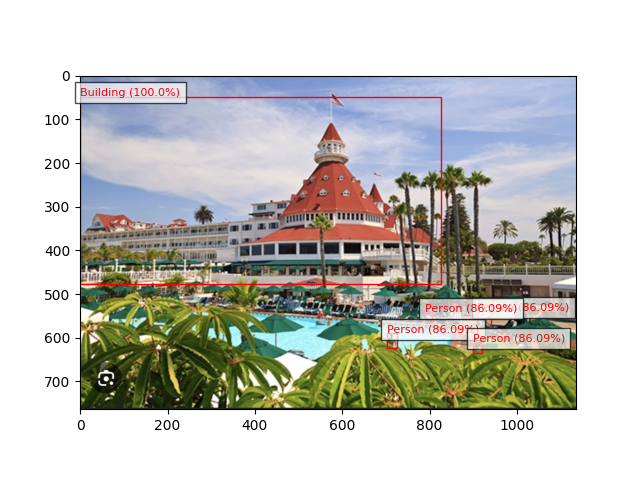

# AWS Rekognition Project
I created a project using AWS features such as an S3 bucket that contains two of my uploaded images, along with an IAM user. I built an image labels generator using Amazon Rekognition. The user inputs an image to the S3 bucket and specifies in the Python file which image and bucket to retrieve the image from. Upon executing the Python file, the AWS service will identify and label the image, as shown in the image of Coronado below!!

